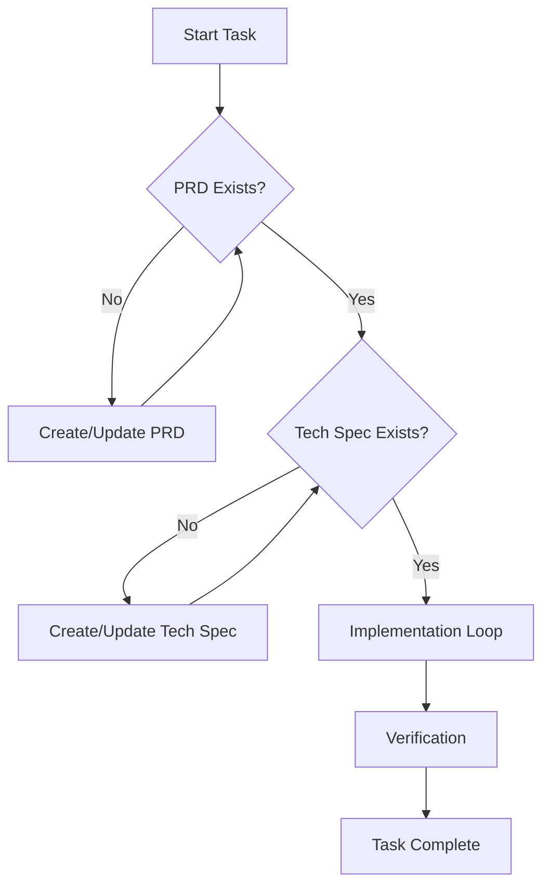

# The Development Process

This document defines the **mandatory** development process for this project. All AI agents (Antigravity, Cursor, etc.) and human developers must follow this workflow to ensure high-quality, well-documented, and robust code.

## The Core Loop

We follow a rigorous waterfall-in-iterative approach:

## Phase 1: Product Requirements (PRD)

**Goal:** Define *what* we are building and *why*.

Before writing any code, ensure there is a clear Product Requirements Document.
-   **Location:** `docs/prd/` (create if needed)
-   **Content:**
    -   Problem Statement
    -   User Stories / Use Cases
    -   Functional Requirements
    -   Non-functional Requirements (Performance, Security)
    -   Success Metrics

**Agent Instruction:**
> "If I ask you to build a feature, check for a PRD. If none exists, stop and ask me to help you draft one, or draft one for my review."

## Phase 2: Technical Specifications (Specs)

**Goal:** Define *how* we will build it.

Once the PRD is approved, create a Technical Specification.
-   **Location:** `docs/specs/` (create if needed)
-   **Content:**
    -   Architecture / High-Level Design
    -   Data Models / Schema Changes
    -   API Endpoints
    -   Component Hierarchy
    -   Traceability to PRD Requirements

**Agent Instruction:**
> "Do not start coding until the architecture is defined. Write a spec file first."

## Phase 3: Implementation

**Goal:** Write the code.

1.  **Plan:** Break down the spec into smaller tasks (e.g., `task.md`).
2.  **Code:** Implement one chunk at a time.
3.  **Test:** verify each chunk immediately (unit tests, manual checks).

**Agent Instruction:**
> "Follow the plan in `task.md`. Update it as you go."

## Phase 4: Verification & Documentation

**Goal:** Prove it works and is maintainable.

1.  **Verification:** Run all tests. Perform manual smoke tests.
2.  **Documentation:** Update `README.md`, inline docs, and `docs/` as needed.
3.  **Artifacts:** Create a `walkthrough.md` if requested to show proof of work.

## Enforcement

**For AI Agents:**
You are NOT allowed to skip steps. If a user asks for a quick feature, you must:
1.  Acknowledge the request.
2.  Briefly outline the PRD/Spec (even if purely in-chat for very small tasks, but prefer files).
3.  Proceed only after clear agreement on the "What" and "How".

**For Humans:**
Please review the PRDs and Specs critically before approving implementation.
